<h1 align="center">
  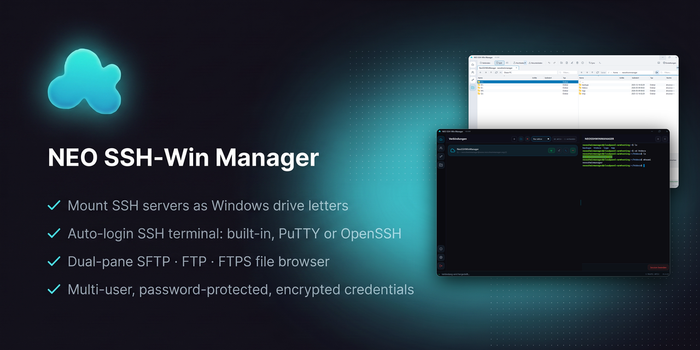
</h1>

<p align="center">
  A modern Windows desktop app for mounting remote SSH filesystems as Windows drive letters with a centralized solution for SSH access<br/>
  Built on top of <a href="https://github.com/winfsp/sshfs-win">sshfs-win</a> and <a href="https://github.com/winfsp/winfsp">WinFsp</a>.
</p>

<p align="center">
  <a href="https://github.com/gregorkrebs/neosshwinmanager/releases/latest">
    
  </a>
  <a href="https://github.com/gregorkrebs/neosshwinmanager/blob/main/LICENSE">
    
  </a>
  
  
  
</p>

<p align="center">
  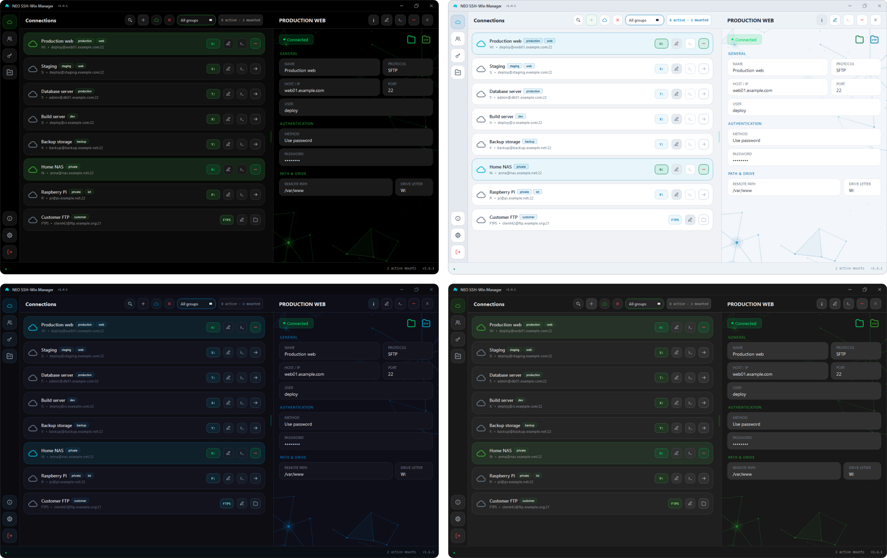
</p>

<p align="center">
  <a href="https://www.neosshwinmanager.org/app">
    
  </a>
</p>

Manage multiple SSH connections, mount them with one click, switch languages per user, and browse remote paths in Windows Explorer as if they were local drives.

---

## Features

- **One-click mounting** of remote SSH filesystems as Windows drive letters via SSHFS-Win / WinFsp.
- **SSH terminal** per connection — the integrated in-app terminal (several sessions per connection, in tabs), Windows OpenSSH or PuTTY.
- **File browser for SFTP, FTPS and FTP, built into the main window** — every host in its own tab, this PC and the server side by side with drag & drop, a transfer queue that resumes interrupted transfers, undo/redo, conflict handling with file comparison, editing in your own programs, folder sync and server-side archives. FTP over TLS works in explicit (AUTH TLS, port 21) and implicit (port 990) mode, plain FTP for legacy servers; plain-FTP hosts can also be handed to the on-board Windows Explorer FTP client.
- **Linux and Windows servers** — servers running OpenSSH for Windows work in the file browser, as mounted drives (including subfolders such as `C:\Projects`) and in the system info panel.
- **Password authentication** with stored credentials — passwordless login without using SSH keys.
- **Public key authentication.**
- **SSH certificate authentication.**
- **Live remote system info panel** (OS, CPU, RAM, drives, uptime, load, temperature) for Linux and Windows servers.
- **No setup at the first start:** the app starts in single-user mode and signs you in automatically; its password is kept in Windows Credential Manager. When several people share the computer, create **accounts with passwords** instead. Credentials are stored encrypted (SQLite + cryptography).
- **Per-user language** (English, German, Spanish, Russian, Dutch, Arabic — easily extensible; Arabic mirrors the UI right-to-left), selectable right on the login screen. The login screen also takes the theme and accent colour of the user who signed in last.
- **System tray** with quick mount toggles, minimize to tray.
- **Auto drive-letter detection** (free letters only) and ghost-drive cleanup.
- "Start with Windows" and "Auto-reconnect on connection loss" options.
- **Optional CLI companion** for scripting / agent integration.
- **Four themes** — Black, Blue (classic), Gray and Light — with an accent colour of your own and a text colour on it that is chosen automatically or by you. A network of linked nodes runs behind the empty overview, a host's details, user management and the profile (can be switched off).
- **Filter the connection list** by name, host or user name, with every character you type; the filter stays until you clear it.
- **Help where you need it:** the connection form links every field to the [online documentation](https://www.neosshwinmanager.org/en/docs/connections#connection-form), with tips such as how to find the remote path.

## Screenshots

Every picture shows the four themes: **Black** (top left) and **Gray** (bottom right) with the accent colour `#228c2b`, **Light** (top right) and **Blue (classic)** (bottom left) with the default accent. All hosts, users and data are fictional.

<p align="center">
  <br/>
  <sub><b>Connections and a host's details</b></sub>
</p>

<p align="center">
  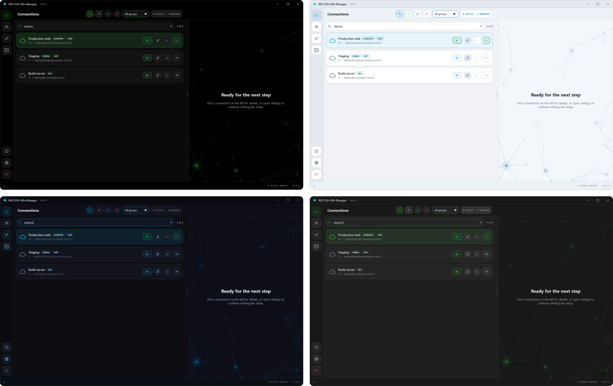<br/>
  <sub><b>Filter by name, host or user</b></sub>
</p>

<p align="center">
  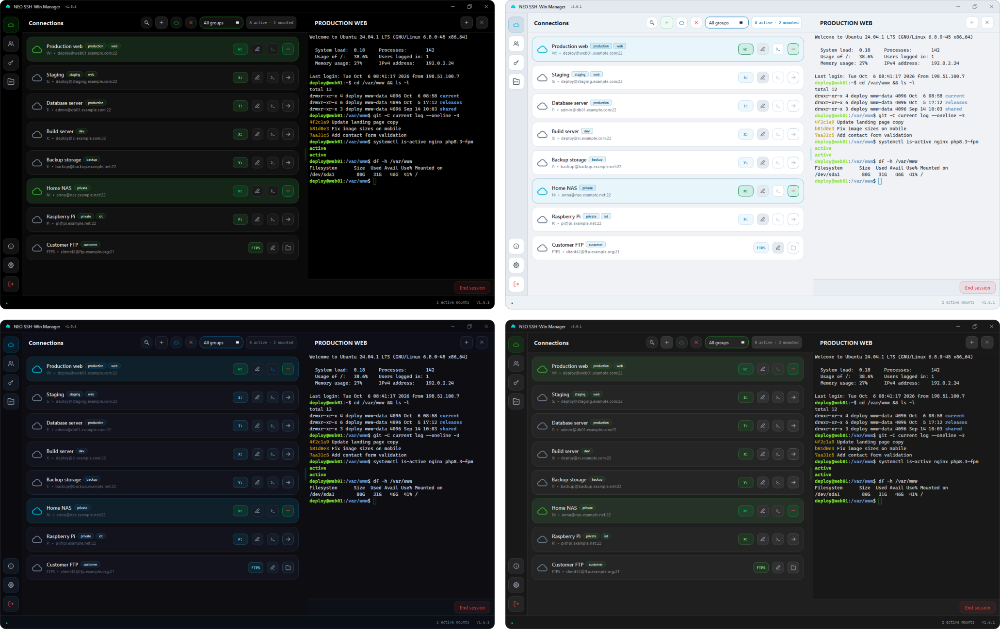<br/>
  <sub><b>Integrated terminal</b></sub>
</p>

<p align="center">
  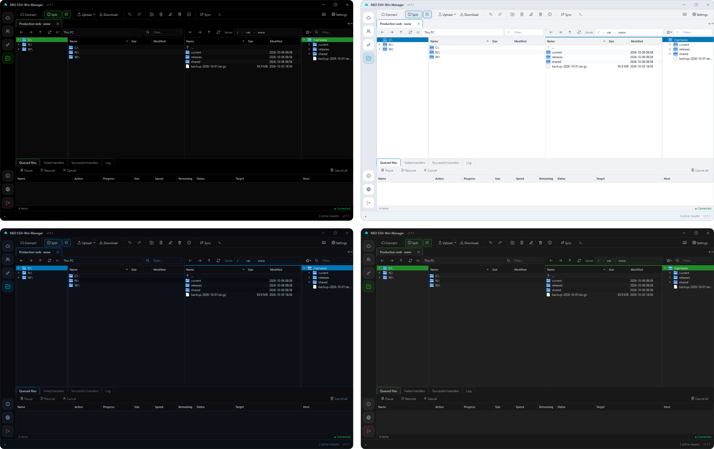<br/>
  <sub><b>File browser: this PC and the server side by side</b></sub>
</p>

<p align="center">
  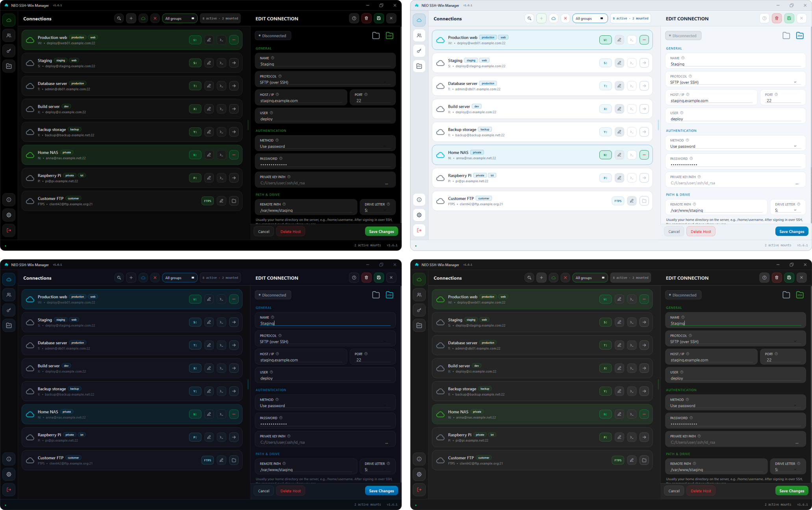<br/>
  <sub><b>Add / edit a connection, with help for every field</b></sub>
</p>

<p align="center">
  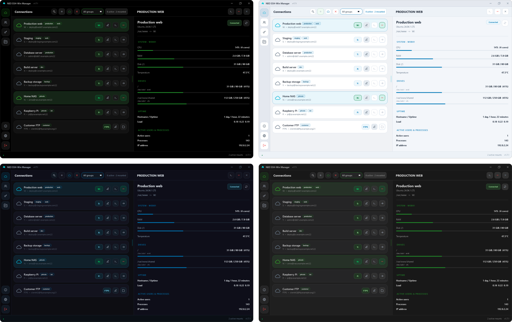<br/>
  <sub><b>Live system info</b></sub>
</p>

<p align="center">
  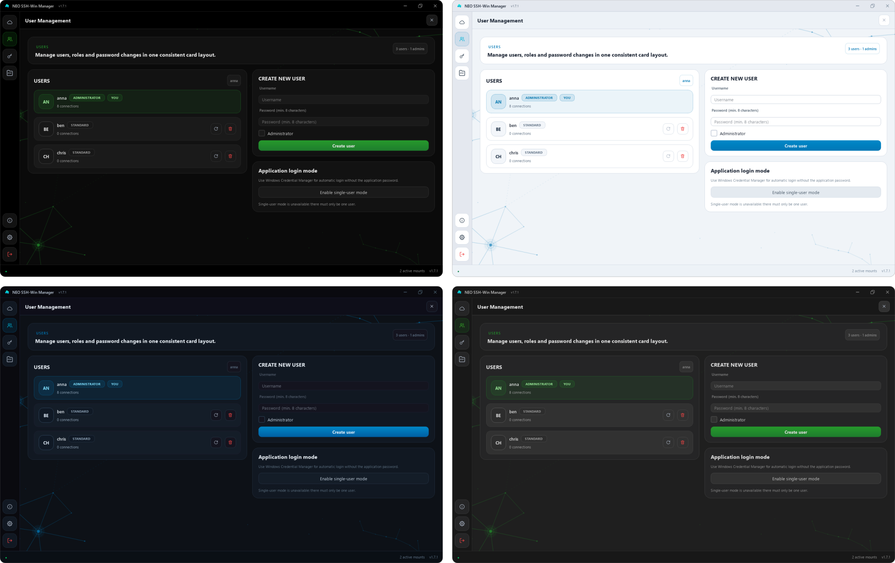<br/>
  <sub><b>User management</b></sub>
</p>

<p align="center">
  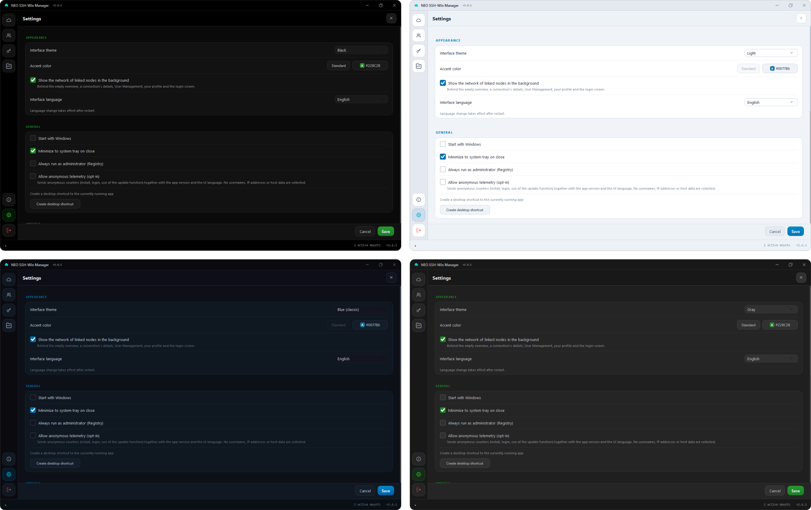<br/>
  <sub><b>Settings</b></sub>
</p>

<table>
  <tr>
    <td align="center" width="62%">
      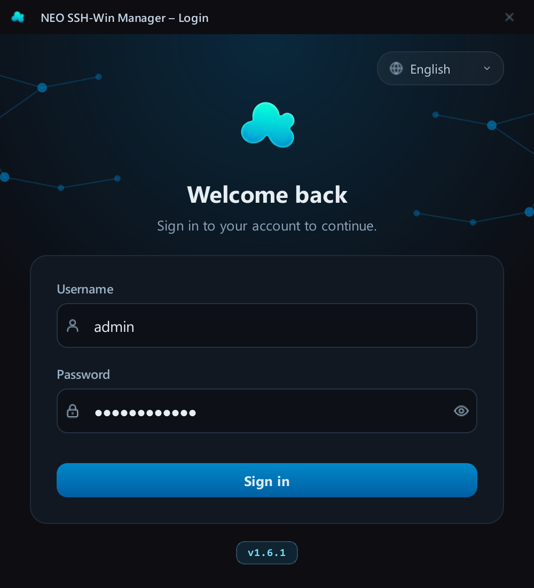<br/>
      <sub><b>Login with language picker</b></sub>
    </td>
    <td align="center" width="38%">
      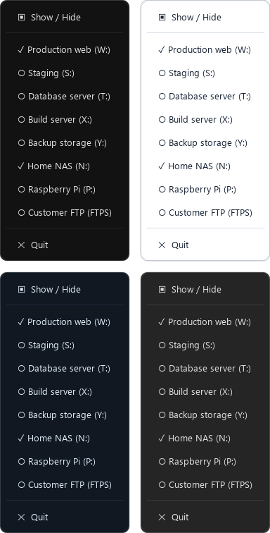<br/>
      <sub><b>System tray with quick mount toggles</b></sub>
    </td>
  </tr>
</table>

## Browser Demo
👉 **<https://www.neosshwinmanager.org/app>**

## Prerequisites

Install these before running the app:

| Tool | Download |
| --- | --- |
| **WinFsp** | <https://github.com/winfsp/winfsp/releases> |
| **SSHFS-Win** | <https://github.com/winfsp/sshfs-win/releases> |
| **Python 3.11+** *(only when running from source)* | <https://www.python.org/downloads/> |

## Quick Start (development)

```powershell
git clone https://github.com/gregorkrebs/neosshwinmanager.git
cd neosshwinmanager

python -m venv .venv
.venv\Scripts\activate

pip install -r requirements.txt
python main.py
```

On first launch the app starts in single-user mode: it creates an account with a random password, keeps that password in Windows Credential Manager and signs you in automatically. All SSH credentials you enter are encrypted with a key that this password protects. To sign in with a password of your own, create an account under User Management; your connections and settings are kept. If Windows Credential Manager is not available, the app asks you to create an admin account instead.

## Build as `.exe`

A PyInstaller spec file (`NeoSSHWinManager.spec`) and a PowerShell build script (`build_dual.ps1`) are included. The dual build produces both:

- `NeoSSHWinManager.exe` — the GUI app (windowed subsystem).
- `NeoSSHWinManager-cli.exe` — the CLI companion (console subsystem) used for scripted CLI access.

```powershell
.\build_dual.ps1
```

Outputs land in `dist/`.

## CLI Companion

The CLI companion (`NeoSSHWinManager-cli.exe`) does not read the database directly. It asks the already running GUI app for a connection that has CLI access enabled.

Before using it:

1. Start `NeoSSHWinManager.exe` and log in.
2. Open the target connection in the add/edit dialog.
3. Enable CLI access for that connection.
4. Generate or copy the CLI access key shown there.

Open an interactive SSH session in the current terminal:

```powershell
.\dist\NeoSSHWinManager-cli.exe --connect-cli "<access_key>"
```

Run a single remote command and return its output to the current terminal:

```powershell
.\dist\NeoSSHWinManager-cli.exe --connect-cli "<access_key>" --exec "uname -a"
```

More examples:

```powershell
.\dist\NeoSSHWinManager-cli.exe --connect-cli "<access_key>" --exec "whoami"
.\dist\NeoSSHWinManager-cli.exe --connect-cli "<access_key>" --exec "hostname"
.\dist\NeoSSHWinManager-cli.exe --connect-cli "<access_key>" --exec "cd /var/www && ls -la"
```

You can use the same interface from source during development:

```powershell
python cli_main.py --connect-cli "<access_key>" --exec "hostname"
```

Notes:

- `--connect-cli` is the preferred flag. `-connectssh` is also accepted for compatibility.
- If you omit `--exec`, the CLI opens an interactive shell in the current terminal.
- If the GUI app is not running, no user is logged in, the key is invalid, or CLI access is disabled for that connection, the command exits with an error.

## How mounting works

sshfs-win exposes remote SSH paths under a UNC format that Windows `net use` understands:

```
net use X: \\sshfs.r\user@host!22\var\www /persistent:no
```

The app builds this command automatically from the connection settings and tracks mount state via drive enumeration.

## Project layout

```
neosshwinmanager/
├── main.py                        # GUI entry point
├── cli_main.py                    # CLI entry point (companion exe)
├── requirements.txt
├── NeoSSHWinManager.spec          # PyInstaller spec (GUI)
├── NeoSSHWinManager-cli.spec      # PyInstaller spec (CLI)
├── build_dual.ps1                 # Dual-build helper (GUI + CLI exe)
├── assets/                        # App icons and screenshots
├── src/
│   ├── config.py                  # Data models + JSON config
│   ├── database.py                # SQLite schema + migrations
│   ├── auth_manager.py            # Users, sessions, encrypted credentials
│   ├── connection_manager.py     # Connection CRUD
│   ├── sshfs_controller.py       # Mount / unmount via net use
│   ├── drive_utils.py            # Drive letter helpers
│   ├── i18n.py                   # Translation loader
│   ├── filebrowser/              # File browser (SFTP/FTP/FTPS), a page of the main window
│   ├── remote_os.py              # Detects Windows OpenSSH servers from the SSH banner
│   ├── translations/
│   │   ├── en.json               # English (default)
│   │   ├── de.json               # German
│   │   ├── es.json               # Spanish
│   │   ├── ru.json               # Russian
│   │   ├── nl.json               # Dutch
│   │   └── ar.json               # Arabic (RTL)
│   └── ui/
│       ├── main_window.py
│       ├── connection_card.py
│       ├── system_info_panel.py
│       ├── system_tray.py
│       ├── theme.py
│       └── dialogs/
│           ├── add_edit_dialog.py
│           ├── settings_dialog.py
│           ├── about_dialog.py
│           ├── login_dialog.py
│           └── system_info_dialog.py
└── tests/
    └── test_config.py
```

## Adding a language

Language is stored per user. To add a new language:

1. Copy `src/translations/en.json` to `src/translations/<code>.json` and translate the values.
2. Add the code to `_SUPPORTED` in `src/i18n.py` and to the `_LANG_LABELS` maps in
   `src/ui/dialogs/settings_dialog.py` and `src/ui/main_window.py`.
3. For a right-to-left language, also add the code to `_RTL` in `src/i18n.py` — the app then
   mirrors its layout automatically.
4. Restart the app.

Missing keys automatically fall back to English.

## Run tests

```powershell
python -m pytest tests/ -v
```

## Credits & history

The idea for this tool was inspired by the original **SSHWinManager**, which was written in JavaScript / Electron by a different author.

**NEO SSH-Win Manager is a complete, from-scratch rewrite in Python (PyQt6)**, developed by [**Gregor Krebs**](https://github.com/gregorkrebs). No code from the original project is reused. The goals, scope and architecture have changed substantially:

- Native Python / PyQt6 stack instead of Electron.
- Multi-user support with per-user encrypted SSH credential storage.
- Per-user language preference.
- Per-connection live system info panel.
- Optional CLI access key for agent / automation integration.
- System tray with quick mount toggles.
- Optional PuTTY / OpenSSH terminal launch per connection.

## License

[MIT](LICENSE) — do whatever you want with it. Attribution is appreciated but not required.
